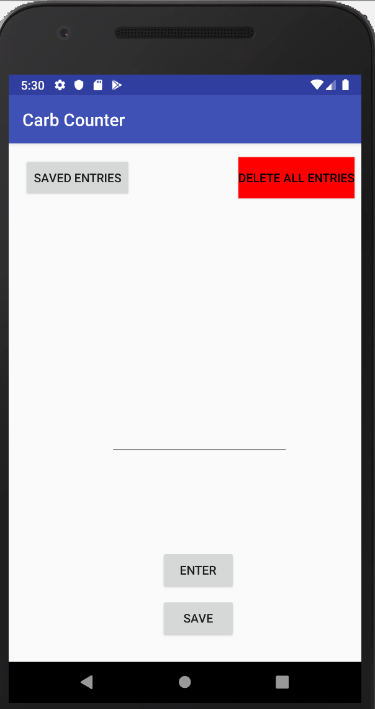

# Carb Counter

Consider this Carb Counter version 1.0

## Features

*Adds up number of carbs for a day
*Saves total number of carbs in a database that leverages Room
*Displays results with timestamp in simple textview

## Future plans:

* RecycleView for a nicer display
* Fix delete button glitch
* Different time stamp method, preferably something compatible with earlier Android versions

## Built With

* Kotlin
* Room ORM for the database (SQLite abstraction)
* Android Studio
